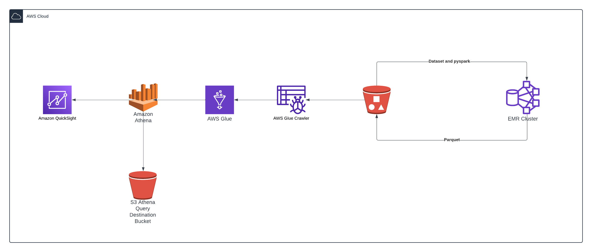

# Data Processing and Visualization Pipeline

This repository contains a data processing and visualization pipeline using AWS services, provisioned with Terraform. The pipeline includes steps from storing data in S3 to creating a dashboard in Amazon QuickSight.

## Overview

The pipeline consists of the following steps:

1. **Dataset and Code in S3**: Data and code are stored in an S3 bucket.
2. **EMR Cluster**: Terraform provisions an EMR (Elastic MapReduce) cluster to process data from S3 and output results in Parquet format back to S3.
3. **AWS Glue**: Terraform configures AWS Glue to crawl the Parquet data in S3 and create a database and tables.
4. **Amazon Athena**: SQL queries in Athena for data analysis.
5. **QuickSight Dashboard**: Visualization and dashboard creation in Amazon QuickSight.

## Components

- **Dataset and Code**: Stored in S3.
- **EMR Cluster**: Configured and provisioned using Terraform scripts.
- **AWS Glue**: Crawlers configured via Terraform to read and catalog Parquet data in your S3 bucket.
- **Amazon Athena**: SQL queries for data analysis.
- **QuickSight Dashboard**: Visualization and dashboard creation.

## Setup

To set up and run the pipeline:

1. **Terraform Configuration**: Ensure Terraform is installed and configured with appropriate AWS credentials.
2. **Terraform Apply**: Execute `terraform apply` to provision the infrastructure.
3. **EMR Cluster**: Use Terraform to create and configure your EMR cluster.
4. **AWS Glue**: Configure Terraform scripts to define crawlers and data cataloging.
5. **Amazon Athena**: Write SQL queries to analyze the data.
6. **QuickSight**: Connect QuickSight to Athena and create your dashboard.

## Architectural Diagram

